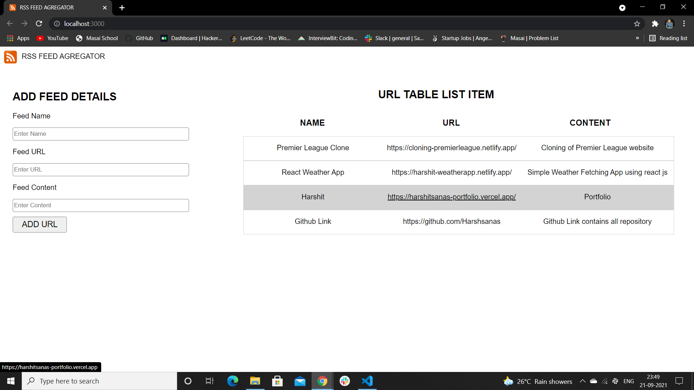

# Crud-App-Insight

# CRUD app using MongoDB, ExpressJS, ReactJS & NodeJS

<h1>TECH STACK</h1>

REACT JS

MongoDB

Express JS

Node JS

# To run Backend cd backend ==>> npm run servers

# To run frondend npm start

# github link 
# <a href="https://github.com/Harshsanas/Crud-App-Insight.git"> https://github.com/Harshsanas/Crud-App-Insight.git
  
# Git Clone https://github.com/Harshsanas/Crud-App-Insight.git
  
# cd backend >> npm i >> npm run server
  
#..cd npm i
  
#npm start http://localhost:3000/
 
